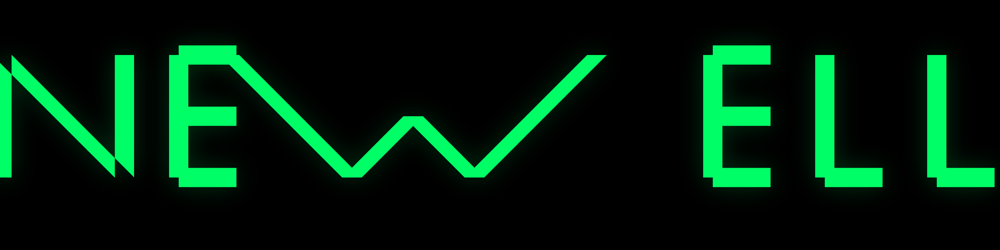

# Newell



[](https://github.com/JordanNewell/newell-typeface/actions/workflows/ci.yml)
[](https://github.com/JordanNewell/newell-typeface/actions/workflows/release.yml)
[](OFL.txt)

> A display typeface built from parallel rails and decisive 45° diagonals.
> Precision. Movement. Connection.

**Newell** is an original geometric display typeface. Every glyph is
assembled from the same vocabulary — vertical rails, horizontal bars,
and 45° diagonals — joined with squared terminals. The system is
parametric: glyphs are generated from declarative rules, not
hand-drawn, so the entire alphabet inherits one visual grammar.

---

## Links

- **Live site:** <https://jordannewell.github.io/newell-typeface/>
- **Try it (interactive):** <https://jordannewell.github.io/newell-typeface/try.html>
- **Technical specimen:** <https://jordannewell.github.io/newell-typeface/specimen/>
- **Latest release:** <https://github.com/JordanNewell/newell-typeface/releases/latest>
- **Roadmap:** [ROADMAP.md](ROADMAP.md)

---

## Status

**v0.1.1-alpha** — uppercase A–Z, digits 0–9, basic punctuation,
common symbols (⚡ · → ← — ★ ☆ ✗). 71 glyphs total. Single weight
(Regular). Static build (variable axes planned for v0.2).

Treat v0.x as a tech preview. Each glyph follows the rules, but the
rules themselves will tighten as the typeface matures.

### Known v0.1 limitations

The v0.1 DNA forbids curves, rounded terminals, and any angle other
than 45°. This makes several traditional letterforms impossible to
render cleanly. Honest trade-offs:

- **S reads as Z** — pure rails + 45° vocabulary cannot render an
  unambiguous S. v0.2 will add a third primitive type to fix it.
- **C, D, G, O, P, Q, R, B** are rectilinear approximations of curved
  letters (squared frames, not curved bowls).
- **A, V, W** are wider than the alphabet average — each leg is a
  full-cap-height 45° diagonal (geometrically forced).
- **M, W** inner notches reach only mid-height (y=350), not baseline.
- **Digits 2, 3, 5, 8** inherit the S-family legibility issue. **0**
  is visually identical to **O** and **D** — context disambiguates.
- **$, @** are best-effort approximations.
- **✓ check mark** omitted entirely — impossible in pure 45°
  vocabulary; deferred to v0.2.

Recommended for **display and headline use**, not long-form body text.

---

## The DNA in one paragraph

All glyphs live on a 1000-unit em. Cap height 700, x-height 500,
descender -200. Strokes are 110 units wide with squared terminals.
Diagonals are exactly 45°. The vocabulary is three primitives:
**rail** (vertical or horizontal bar), **diagonal** (45° stroke),
and **junction** (squared connection between primitives). The
signature diagonal of the `N` — the one that connects the top of one
rail to the bottom of another — reappears in `M`, `K`, `R`, `V`, `W`,
`X`, `Y`, `Z`, and the digits `1`, `2`, `4`, `7`. That recurring
diagonal is the family resemblance.

See [SPEC.md](SPEC.md) for the full constitution.

---

## Repository layout

```
newell-typeface/
├── OFL.txt                    SIL Open Font License 1.1
├── AUTHORS.txt                Attribution
├── SOURCES.txt                Provenance (original work)
├── SPEC.md                    Typeface DNA constitution
├── CHANGELOG.md               Release history
├── ROADMAP.md                 v0.2 → v1.0 plan
├── requirements.txt           Python deps
│
├── index.html                 Coming soon landing page
├── about.html                 About / DNA / roadmap page
├── try.html                   Interactive type tester
├── og-image.html              Source for assets/og.png
├── site.webmanifest           PWA metadata
│
├── assets/                    Logo, OG image, favicons, wordmark
├── releases/                  Built font binaries (OTF, TTF, WOFF2)
├── sources/                   UFO masters (generated)
├── specimen/                  Technical specimen page
│
├── src/newell/                Parametric glyph generator (Python)
│   ├── primitives.py          vline / hline / diag expanders
│   ├── generator.py           Boolean union + UFO assembly
│   ├── font.py                UFO metadata
│   ├── glyphs.py              Declarative glyph definitions
│   └── test_generator.py      Test suite
│
├── scripts/
│   ├── build.py               Generate UFO only
│   ├── build_all.py           UFO → OTF + TTF + WOFF2 (end-to-end)
│   ├── preview.py             Render glyph PNGs from UFO
│   ├── screenshot.py          Playwright HTML screenshots
│   ├── render_assets.py       Re-render OG / wordmark / N-mark
│   └── render_favicons.py     Resize N-mark → favicon variants
│
└── .github/workflows/         CI (test+build) + Release (tag → binaries)
```

---

## Building

Requires Python 3.10+ and the deps in `requirements.txt`:

```bash
py -m pip install -r requirements.txt
py scripts/build_all.py     # generates UFO + compiles OTF/TTF/WOFF2
```

Output appears under `releases/`. Current sizes:

| Format | Size |
|--------|------|
| OTF    | ~5.0 KB |
| TTF    | ~6.4 KB |
| WOFF2  | ~2.1 KB |

To regenerate brand assets (OG image, wordmark, favicons) after
changing the font:

```bash
py scripts/render_assets.py     # OG + wordmark + N-mark via Playwright
py scripts/render_favicons.py   # favicon variants via Pillow
```

---

## Releases

Releases are automated via GitHub Actions.

- Push to `master` → CI runs tests + rebuilds binaries
- Push a `v*` tag → release workflow builds, extracts the matching
  CHANGELOG section, and publishes a GitHub Release with OTF/TTF/WOFF2
  attached

```bash
git tag v0.2.0
git push origin v0.2.0
# GitHub Actions does the rest
```

---

## License

Released under the [SIL Open Font License 1.1](OFL.txt). Free for
commercial use, modification, and redistribution provided the font
and any derivatives remain under the OFL.

Copyright © 2026 Jordan Newell. "Newell" and the Newell logotype are
trademarks of Jordan Newell.

---

## Credits

Design and engineering: **Jordan Newell** ([jordannewell.com](https://jordannewell.com))

Generated parametrically from [SPEC.md](SPEC.md) — no existing
typeface was traced or used as a metrics reference.
